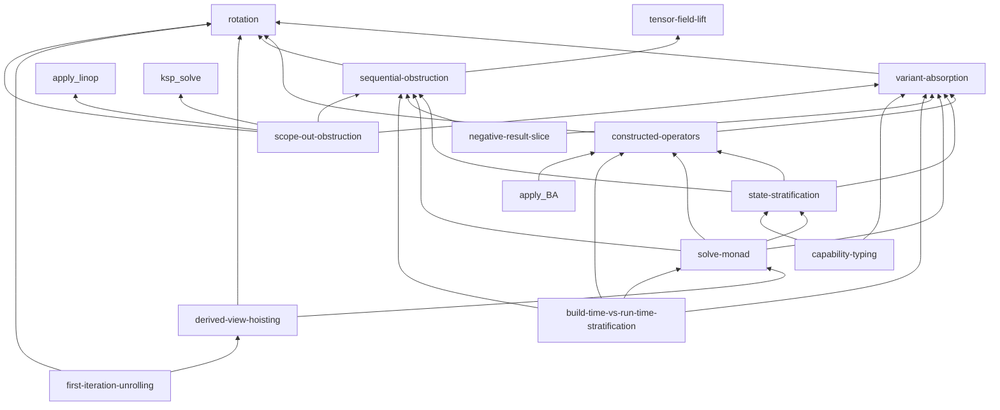
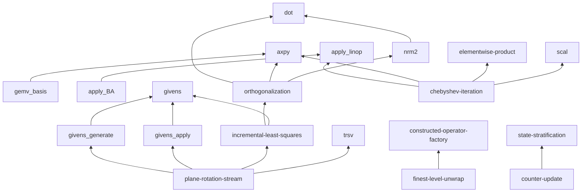
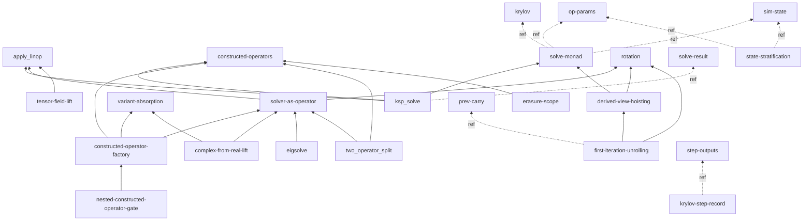

# Concept dependency map

Dependency map of the concept pages in `book/src/concepts/`. Maintained by the integrator when a `layer-intro-author`
dispatch lands a new concept page: the **same diff** that adds `concepts/<name>.md` adds its node + edges here.

The map serves two purposes:

- **Bottom-up vocabulary.** Leaf primitives (`axpy`, `dot`, `nrm2`, `scal`, `apply_linop`, `trsv`, …) give the
  vocabulary to describe the layered chapters concisely; the layer patterns and algorithms compose them. Reading the map
  answers "what shared vocabulary is available, and what does each concept rest on?"
- **Cross-cutting framework discovery.** Methodology concepts (`rotation`, `variant-absorption`,
  `constructed-operators`, `sequential-obstruction`) accumulate from cross-cycle friction integration. Reading the map
  answers "what methodology tools does the pipeline have for handling cross-cutting concerns?"

**Edge convention** (light typing; the meta-phase-owned graded-stack full typing pass is authoritative):

- A solid edge `A --> B` is a **`depends-on`** edge — concept `A` is *defined in terms of* concept `B` (B is the
  more-primitive dependency). Every node is an on-disk page (`book/src/concepts/<name>.md` exists).
- An edge annotated `-.->|ref|` is a **`reference`** (navigational see-also) edge — `A` mentions `B` for orientation but
  is not defined in terms of it.

Every node below corresponds to an on-disk concept page. The forward-projection `:::planned` machinery (roadmap-slice
markers) was retired with the Phase-1 slice corpus (deleted cycles 097/098/099); planned/speculative vocabulary now
lands as rank-0 `roadmap_goal` book chapters in the L_n Parts (graded resolution ladder), not as dashed nodes here.
The scaffolding WIP version at `scaffolding/concept-dependency-map.md` tracks pending extractions and hypothetical
concepts not yet stable enough for the book.

## Methodology concepts (cross-layer)

Methodology primitives applicable across all layers. Extracted from cross-cycle friction during meta-reviews.

- [`rotation`](./rotation.md) — root methodology concept. Defines what counts as a genuine rotation (state hiding / coarser substitution / threaded-state compression) vs. a renaming. Codified meta-review #1; expanded with carry-through clause meta-review #2.
- [`variant-absorption`](./variant-absorption.md) → depends on `rotation`. Parametric vs. appended absorption of orthogonal variants; levels-of-absorption refinement meta-review #3 (invariant / procedural / primitive-sequence).
- [`constructed-operators`](./constructed-operators.md) → depends on `rotation`, `variant-absorption`. Standard graph-evaluation pattern: construct an operator with internal immutable state once, apply pure-function many times. Canonical route to full variant absorption (all three levels) when configs/tables would otherwise be deep-plumbed.

## Primitives + algorithms (leaf vocabulary)

Leaf tensor/linear-algebra primitives and the algorithm-tier concepts built directly on them. Each node is an on-disk
concept page; the more-primitive dependency sits at the arrow head (`graph BT`, bottom = most primitive).

Leaf primitives with no concept-level dependency (referenced widely across the L_n Parts) appear as bare nodes:
`axpy`, `dot`, `scal`, `apply_linop`, `trsv`, `elementwise-product`, `set_subvector_zero`,
`givens`, `gemv_basis`, `scalar-promotion`.

## Layer patterns + records

How the layers' rotations are organized (`layer-pattern` Kind) and the record data-shapes (`record` Kind) they thread.
The record pages are leaves here (data-shape definitions); the layer patterns that consume them carry `reference` edges
to them.

The `record` Kind pages (`krylov`, `op-params`, `sim-state`, `step-outputs`, `prev-carry`, `solve-result`,
`config-record`) are data-shape definitions — they sit at the leaves (a record is *defined by* its fields, it does not
depend on the operators that thread it). The layer patterns above reference them with `-.->|ref|` edges. The
`krylov-step-record` node above is the `state-stratification` worked example's record bundle; it is the on-disk
`krylov` page (alias kept readable for the edge).

## L4 calculus + feature spine (tracked elsewhere)

The methodology primitives applicable across all layers are in the `## Methodology concepts (cross-layer)` section
above (the single methodology sub-graph — not duplicated here).

The L4 calculus has its own design artifact at [`book/src/design/l4_calculus.md`](../design/l4_calculus.md). L4 grammar
productions, reduction rules, and ownership categories are not tracked here — the calculus is a single document with its
own internal structure. The feature-surface spine (`book/src/feature/`) composes these concepts into entry-point
columns; those compositions are tracked in the per-column chapters + `feature/index.md`, not duplicated here.

## Maintenance protocol

When a `layer-intro-author` dispatch introduces a new concept page, the **same proposed-changes diff** must update this
dependency map. Specifically:

1. **Add the new concept** under its appropriate sub-graph above (primitives+algorithms / layer-patterns+records /
   methodology).
2. **List its dependencies** — the other concept pages it is *defined in terms of* (`depends-on`, solid edge) and the
   ones it merely cross-references (`reference`, `-.->|ref|` edge).
3. **Update the mermaid graph** to reflect the new node and edges.

A concept page that exists in `book/src/concepts/` but is not represented in this map is structurally orphaned. The
graded-stack reachability linter (`tools/`, mark-sweep from the feature-surface roots) is the authoritative orphan
check; a concept reachable only here but not from any chapter is a GC candidate.

The scaffolding version at `scaffolding/concept-dependency-map.md` is the workshop where:
- Pending concept extractions are sketched before they stabilize.
- Cross-cutting dependencies the meta-phase notices but hasn't yet incorporated are tracked.
- Hypothetical concepts ("we'll need something like X eventually") are listed for future cycles to act on.

## Origin

Introduced 2026-05-23 to operationalize the "build vocabulary bottom-up" principle (CLAUDE.md §Bunsen methodology
conventions). Re-derived to the post-redirect artifact state in cycle-101 (the Phase-1 slice corpus + the pre-redirect
orchestrator/`prompts/` roles were retired and deleted; the Mermaid node set is re-anchored to the on-disk concept
pages).
