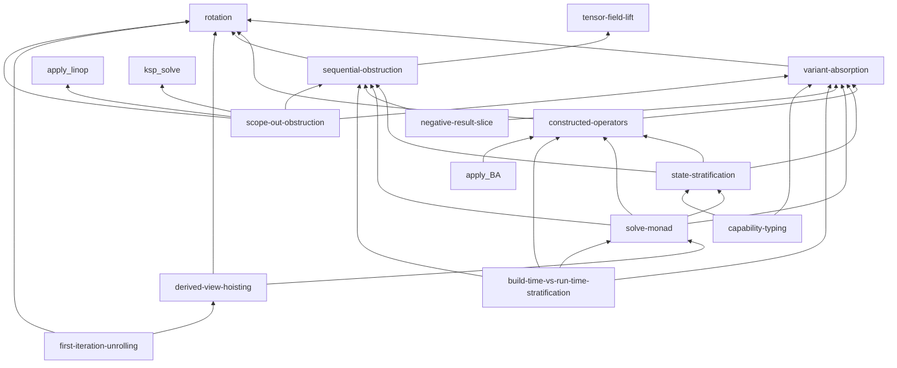
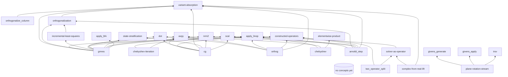
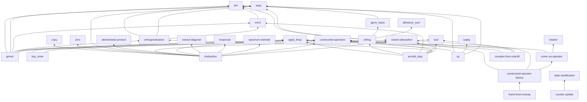
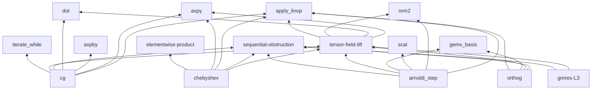

# Concept dependency map

Per-layer map of concepts in `book/src/concepts/`. Maintained by the Synthesizer when emitting new concept entries (per `prompts/synthesizer.md` *Build vocabulary bottom-up*); future markers added by the Synthesizer/Meta-Critic when planning pipeline work.

The map serves three purposes:

- **Bottom-up vocabulary.** Support-operator concepts at L1 give the vocabulary to describe complex L1 slices concisely; L2 algebraic decompositions give the vocabulary for L2 slices, etc. Reading the map answers "what primitives does this layer have available?"
- **Cross-cutting framework discovery.** Methodology concepts (rotation, variant-absorption, constructed-operators) accumulate from cross-cycle friction integration. Reading the map answers "what methodology tools does the loop have available for handling cross-cutting concerns?"
- **Forward projection** (added 2026-05-25 from user directive). The map also includes mechanisms that have NOT YET been provided — concepts and slices the roadmap names as in-scope but the loop hasn't extracted yet. These appear as **planned nodes** styled with `:::planned` (dashed outline). Reading the map this way answers "what's coming next, and which existing concepts will it build on?"

**Node style convention:**

- Solid-outline nodes are on-disk concepts (a file exists at `book/src/concepts/<name>.md`).
- Dashed-outline nodes (`:::planned`) are future markers — items from `scaffolding/roadmap.md` not yet extracted. They depend on existing concepts via solid edges; their own placement names where they will sit in the layer hierarchy when extracted.
- An edge from a `:::planned` node to an existing concept is a *forward commitment*: when this concept is extracted, it will build on these existing primitives.
- An edge between two `:::planned` nodes is a *planned-pipeline edge*: both are future markers and the dependency is anticipated.

The scaffolding WIP version at `scaffolding/concept-dependency-map.md` tracks pending extractions and hypothetical concepts that aren't yet stable enough for the book.

## Methodology concepts (cross-layer)

Methodology primitives applicable across all layers. Extracted from cross-cycle friction during meta-reviews.

- [`rotation`](./rotation.md) — root methodology concept. Defines what counts as a genuine rotation (state hiding / coarser substitution / threaded-state compression) vs. a renaming. Codified meta-review #1; expanded with carry-through clause meta-review #2.
- [`variant-absorption`](./variant-absorption.md) → depends on `rotation`. Parametric vs. appended absorption of orthogonal variants; levels-of-absorption refinement meta-review #3 (invariant / procedural / primitive-sequence).
- [`constructed-operators`](./constructed-operators.md) → depends on `rotation`, `variant-absorption`. Standard graph-evaluation pattern: construct an operator with internal immutable state once, apply pure-function many times. Canonical route to full variant absorption (all three levels) when configs/tables would otherwise be deep-plumbed.

## Intermediate-tier algorithms (planned — roadmap)

Algorithmic primitives that sit between leaf primitives (axpy, dot, …) and top-level driver algorithms (CG, GMRES, …). Currently all dashed-outline (planned); none yet extracted. See `scaffolding/roadmap.md` *Intermediate-tier algorithms* for impact ranking. The Planner positively selects from this tier per `prompts/planner.md` Forward-frontier criterion.

```mermaid
graph BT
  arnoldi-step:::planned --> apply_linop
  arnoldi-step:::planned --> orthogonalization
  arnoldi-step:::planned --> dot
  arnoldi-step:::planned --> axpy
  arnoldi-step:::planned --> nrm2

  plane-rotation-stream:::planned --> givens
  plane-rotation-stream:::planned --> incremental-least-squares

  polynomial-recurrence-step:::planned --> axpy
  polynomial-recurrence-step:::planned --> elementwise-product
  polynomial-recurrence-step:::planned --> scal

  sparse-triangular-solve:::planned --> trsv

  diagonal-preconditioner-apply:::planned --> elementwise-product

  residual-update:::planned --> apply_linop
  residual-update:::planned --> axpy

  restart-machinery:::planned --> state-stratification
  restart-machinery:::planned --> solve-monad

  %% Future top-level slices that consume intermediates:
  minres:::planned --> arnoldi-step:::planned
  minres:::planned --> plane-rotation-stream:::planned
  eigenmode:::planned --> arnoldi-step:::planned
  eigenmode:::planned --> plane-rotation-stream:::planned
  bicgstab:::planned --> residual-update:::planned
  jacobi:::planned --> diagonal-preconditioner-apply:::planned
  jacobi:::planned --> polynomial-recurrence-step:::planned
  ilu:::planned --> sparse-triangular-solve:::planned
  gauss-seidel:::planned --> sparse-triangular-solve:::planned
  ams:::planned --> sparse-triangular-solve:::planned
  ams:::planned --> diagonal-preconditioner-apply:::planned
  multigrid-v-cycle:::planned --> restart-machinery:::planned

  %% Existing concepts that intermediates reuse (already on disk):
  apply_linop
  axpy
  dot
  nrm2
  scal
  givens
  trsv
  elementwise-product
  orthogonalization
  incremental-least-squares
  state-stratification
  solve-monad

  classDef planned stroke-dasharray: 5 5,stroke:#888,fill:#fafafa;
```

## L1 — mutation-lifted primitives

Pure-functional re-expressions of in-place mutations from source. Each concept names: signature, input/output sets, mutation pattern observed in source.

(Empty as of 2026-05-23. Will populate as the agent loop's Synthesizer extracts support-operator concepts from slice work. Expected initial candidates from CG/GMRES, per BOOTSTRAP verification rubric: `axpy`, `dot`, `matvec`, `apply_linop`, `norml2`. From GMRES specifically: `arnoldi_step`, `givens_rotation`, `hessenberg_extend`.)

## L2 — algebraic decompositions

Composition of base algebraic primitives, with HPC/SIMD tricks unfolded.

(Empty as of 2026-05-23. Will populate as L1→L2 rotations land.)
s L1→L2 rotations land.)

## L3 — global tensor-field operations

Whole-tensor operations replacing per-element iteration; or `obstruction` results documenting genuine sequentiality.

(Empty as of 2026-05-23. Will populate as L2→L3 rotations land. Expect Krylov outer loops and Arnoldi orthogonalization to be obstructions, not lifts.)
bstructions, not lifts.)

## L4 — formal calculus terms

```mermaid
graph BT
  solve-monad --> state-stratification
  solve-monad --> constructed-operators
  solve-monad --> sequential-obstruction
  gmres-L4 --> state-stratification
  gmres-L4 --> solve-monad
  gmres-L4 --> constructed-operators
  gmres-L4 --> variant-absorption
  gmres-L4 --> sequential-obstruction
  gmres --> state-stratification
  gmres --> solve-monad
  gmres --> constructed-operators
  gmres --> variant-absorption
  gmres --> sequential-obstruction
  state-stratification --> constructed-operators
  state-stratification --> variant-absorption
  state-stratification --> sequential-obstruction
  convergence-test --> constructed-operators
  convergence-test --> variant-absorption
  convergence-test --> solve-monad
  gmres --> convergence-test
  orthog --> state-stratification
  orthog --> solve-monad
  orthog --> constructed-operators
  orthog --> sequential-obstruction
  chebyshev --> solve-monad
  chebyshev --> state-stratification
  chebyshev --> constructed-operators
  chebyshev --> apply_linop
  chebyshev --> tensor-field-lift
  chebyshev --> sequential-obstruction
  chebyshev --> axpy
  chebyshev --> elementwise-product
  chebyshev --> spectrum-estimate
  arnoldi_step --> solve-monad
  arnoldi_step --> state-stratification
  arnoldi_step --> derived-view-hoisting
  arnoldi_step --> variant-absorption
  arnoldi_step --> sequential-obstruction
  arnoldi_step --> apply_linop
  arnoldi_step --> orthogonalization
  arnoldi_step --> nrm2
  arnoldi_step --> scal
  cg --> first-iteration-unrolling
  gmres --> derived-view-hoisting
  chebyshev --> derived-view-hoisting
```

The L4 calculus has its own design artifact at [`book/src/design/l4_calculus.md`](../design/l4_calculus.md). L4 concepts (grammar productions, reduction rules, ownership categories) are not currently tracked here — the calculus is a single document with its own internal structure. If L4 grows to need cross-cycle concept tracking, add a section here at that time.

## Maintenance protocol

When the Synthesizer emits a slice diff that introduces a new concept entry, the **same diff** must update this dependency map. Specifically:

1. **Add the new concept** under its appropriate layer subsection above.
2. **List its dependencies** — the other concepts (at the same layer or below) it references in its body.
3. **Update the mermaid graph** for that layer to reflect the new node and edges.

A concept entry that exists in `book/src/concepts/` but is not represented in this map fails the slice-acceptance criteria — it's structurally orphaned. The Critic's check #N (to be added when friction warrants enforcement) verifies that every concept page has a corresponding map entry and that declared dependencies match body references.

The scaffolding version at `scaffolding/concept-dependency-map.md` is the workshop where:
- Pending concept extractions are sketched before they stabilize.
- Cross-cutting dependencies the Meta-Critic notices but hasn't yet incorporated are tracked.
- Hypothetical concepts ("we'll need something like X eventually") are listed for future cycles to act on.

## Origin

Introduced 2026-05-23 by user direction during the same conversation as the apply-on-revise methodology fix and the constructed-operators concept. The map is the artifact that operationalizes the "build vocabulary bottom-up" principle from `prompts/synthesizer.md` and CLAUDE.md *Process* #5.
