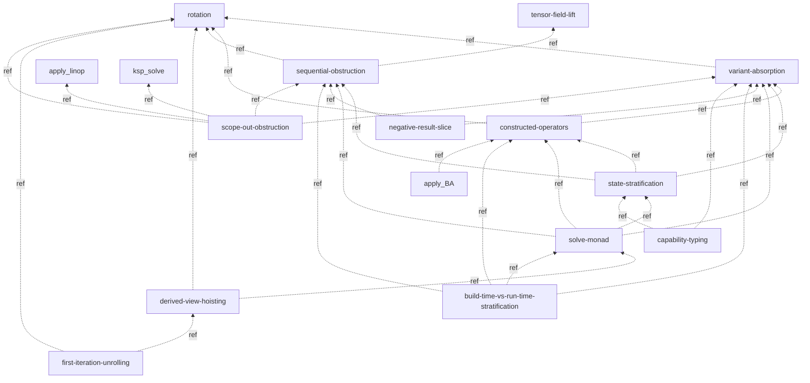
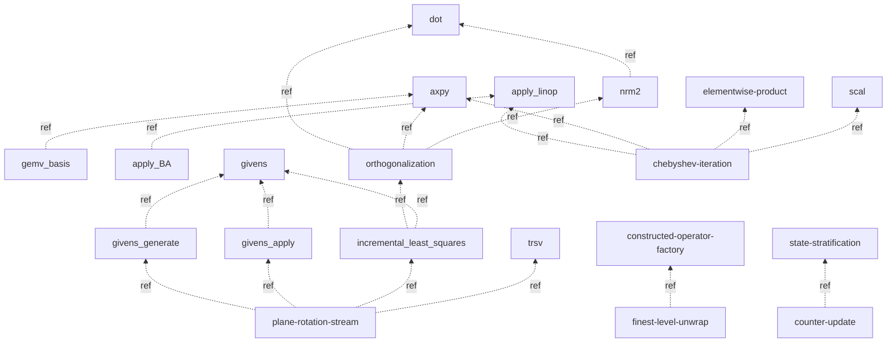
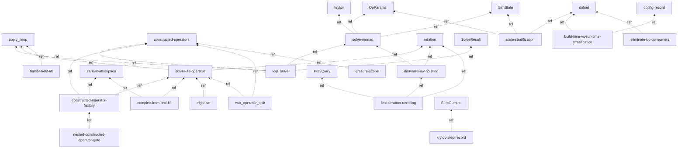

# Concept dependency map

Dependency map of the concept pages in `book/src/concepts/`. Maintained by the integrator when a `layer-intro-author`
dispatch lands a new concept page: the **same diff** that adds `concepts/<name>.md` adds its node + edges here.

The map serves two purposes:

- **Bottom-up vocabulary.** Leaf primitives (`axpy`, `dot`, `nrm2`, `scal`, `apply_linop`, `trsv`, …) give the
  vocabulary to describe the layered chapters concisely; the layer patterns and algorithms compose them. Reading the map
  answers "what shared vocabulary is available, and what does each concept rest on?"
- **Cross-cutting framework discovery.** Methodology concepts (`rotation`, `variant-absorption`,
  `constructed-operators`, `sequential-obstruction`) accumulate from cross-cycle friction integration. Reading the map
  answers "what methodology tools does the pipeline have for handling cross-cutting concerns?"

**Edge convention** (graded-stack typed; the **per-chapter `edges:` blocks are authoritative**, this map is the
derived mirror, scheme §2/§4(b)):

- A dashed edge `A -.->|ref| B` is a **`reference`** (navigational see-also) edge — `A` mentions/points-at `B` for
  orientation, but does not *rest on* it in the well-foundedness sense (constrains no rank, carries no liveness).
- A solid edge `A --> B` is a **`depends-on`** edge — blocking: `A`'s rank is bounded by `B`'s, and `B` is kept live by
  `A`'s reachability.

**The load-bearing typing fact.** A concept page that is a **narrative-pointer / methodology / layer-pattern** page
sits **outside the subject DAG** (scheme §2d, §5) — it is NOT a ranked node, and **every edge it emits is `reference`**
(it points the reader at the firm L_n home; the blocking rank flows the OTHER way, carried by that L_n entry's own
`depends-on` block, not by the concept page). So the overwhelming majority of edges below are `-.->|ref|`. The **only**
concept pages that are DAG nodes are the **`record` Kind** pages (`config-record`, `dofset`, `krylov`, `OpParams`,
`SimState`, `StepOutputs`, `PrevCarry`, `SolveResult`); a record page is a leaf whose only **`depends-on`** edges
are `kind: cites-evidence` edges to its raw L0 backing struct (`palace/...:lines`) — those targets are OFF this
concept-graph (L0 source, not concept pages), so a record node appears here as a **leaf** that layer-pattern pages
`-.->|ref|` into.

Every node below corresponds to an on-disk concept page. Planned/speculative vocabulary lands as rank-0 `roadmap_goal`
book chapters in the L_n Parts (graded resolution ladder), not as dashed nodes here. The scaffolding WIP version at
`scaffolding/concept-dependency-map.md` tracks pending extractions and hypothetical concepts not yet stable enough for
the book.

## Methodology concepts (cross-layer)

Methodology primitives applicable across all layers. Extracted from cross-cycle friction during meta-reviews.

All edges below are `reference` (`-.->|ref|`): every node is a methodology /
layer-pattern concept page — outside the subject DAG (scheme §2d/§5), so it
points-at its peers/primitives but does not `depends-on` them.

- [`rotation`](./rotation.md) — root methodology concept. Defines what counts as a genuine rotation (state hiding / coarser substitution / threaded-state compression) vs. a renaming. Codified meta-review #1; expanded with carry-through clause meta-review #2.
- [`variant-absorption`](./variant-absorption.md) → depends on `rotation`. Parametric vs. appended absorption of orthogonal variants; levels-of-absorption refinement meta-review #3 (invariant / procedural / primitive-sequence).
- [`constructed-operators`](./constructed-operators.md) → depends on `rotation`, `variant-absorption`. Standard graph-evaluation pattern: construct an operator with internal immutable state once, apply pure-function many times. Canonical route to full variant absorption (all three levels) when configs/tables would otherwise be deep-plumbed.

## Primitives + algorithms (leaf vocabulary)

Leaf tensor/linear-algebra primitives and the algorithm-tier concepts built directly on them. Each node is an on-disk
concept page; the more-primitive dependency sits at the arrow head (`graph BT`, bottom = most primitive).

All edges below are `reference` (`-.->|ref|`): these are narrative-pointer
primitive/algorithm concept pages (each points at its authoritative L_n operator
entry; the blocking rank lives on that L_n entry, not on the concept page). A
`concepts/nrm2` page does not `depends-on` `concepts/dot` — it *references* it;
`L1/nrm2`'s own `edges:` block carries any real blocking dependence.

Leaf primitives with no concept-level dependency (referenced widely across the L_n Parts) appear as bare nodes:
`axpy`, `dot`, `scal`, `apply_linop`, `trsv`, `elementwise-product`, `set_subvector_zero`,
`givens`, `gemv_basis`, `scalar-promotion`.

## Layer patterns + records

How the layers' rotations are organized (`layer-pattern` Kind) and the record data-shapes (`record` Kind) they thread.
The record pages are leaves here (data-shape definitions); the layer patterns that consume them carry `reference` edges
to them.

All edges below are `reference` (`-.->|ref|`). The layer-pattern pages point at
the primitives/peers they organize and at the **record** Kind pages they thread;
none is a blocking `depends-on` from a concept page (the blocking edges live on
the operator/feature chapters, scheme §2d/§5). The `record` nodes (`krylov`,
`OpParams`, `SimState`, `StepOutputs`, `PrevCarry`, `SolveResult`,
`config-record`, `dofset`) are DAG-node **leaves** here — their only `depends-on`
edges are `kind: cites-evidence` to raw L0 source (off this concept-graph).

The `record` Kind pages (`krylov`, `OpParams`, `SimState`, `StepOutputs`, `PrevCarry`, `SolveResult`,
`config-record`, `dofset`) are data-shape definitions — they sit at the leaves (a record is *defined by* its fields, it
does not depend on the operators that thread it). **They are the only concept pages that are graded-stack DAG nodes**
(scheme §5): each carries `rank:` (typically `firm` once its L0 backing struct is cited) and a `depends-on (kind:
cites-evidence)` edge to that raw L0 struct — those L0 targets are OFF this concept-graph (they are `palace/...:lines`
source ranges, not concept pages), so a record node shows here as a leaf the layer-pattern pages `-.->|ref|` into. The
record `dofset` (`DofSet[N]`, the essential-dof
index set produced by `essential_dofs` and consumed by the `eliminate_bc` verb-pair; see
[`dofset`](./dofset.md)) is referenced by `state-stratification` (it is part of the readonly BC stratum) and
`build-time-vs-run-time-stratification` (it sits on the build-time side); `eliminate-bc-consumers` in the graph above is
the alias for the L1/L4 BC verb-pair that names it (the consumers live in the L_n Parts, not as a concept page). The
`krylov-step-record` node above is the `state-stratification` worked example's record bundle; it is the on-disk
`krylov` page (alias kept readable for the edge).

## L4 calculus + feature spine (tracked elsewhere)

The methodology primitives applicable across all layers are in the `## Methodology concepts (cross-layer)` section
above (the single methodology sub-graph — not duplicated here).

The L4 calculus has its own design artifact at [`book/src/semantics/index.md`](../semantics/index.md). L4 grammar
productions, reduction rules, and ownership categories are not tracked here — the calculus is a single document with its
own internal structure. The feature-surface spine (`book/src/feature/`) composes these concepts into entry-point
columns; those compositions are tracked in the per-column chapters + `feature/index.md`, not duplicated here.

## Maintenance protocol

When a `layer-intro-author` dispatch introduces a new concept page, the **same proposed-changes diff** must update this
dependency map. Specifically:

1. **Add the new concept** under its appropriate sub-graph above (primitives+algorithms / layer-patterns+records /
   methodology).
2. **List its dependencies** — the other concept pages it is *defined in terms of* (`depends-on`, solid edge) and the
   ones it merely cross-references (`reference`, `-.->|ref|` edge).
3. **Update the mermaid graph** to reflect the new node and edges.

A concept page that exists in `book/src/concepts/` but is not represented in this map is structurally orphaned. The
graded-stack reachability linter (`tools/`, mark-sweep from the feature-surface roots) is the authoritative orphan
check; a concept reachable only here but not from any chapter is a GC candidate.

The scaffolding version at `scaffolding/concept-dependency-map.md` is the workshop where:
- Pending concept extractions are sketched before they stabilize.
- Cross-cutting dependencies the meta-phase notices but hasn't yet incorporated are tracked.
- Hypothetical concepts ("we'll need something like X eventually") are listed for future cycles to act on.

The Mermaid node set is anchored to the on-disk concept pages, operationalizing the "build vocabulary bottom-up"
principle (CLAUDE.md §Bunsen methodology conventions).
