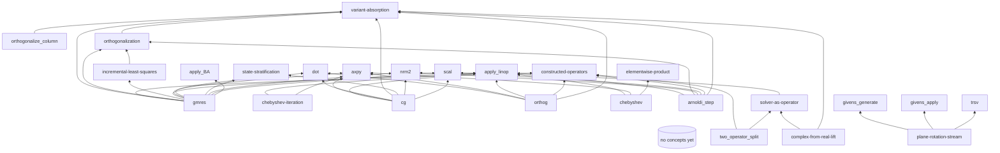
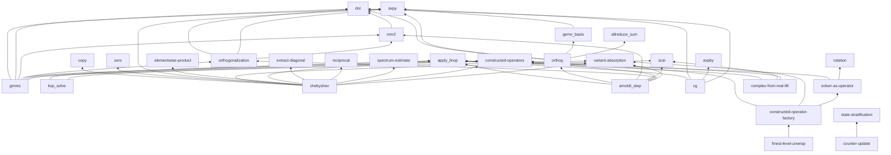
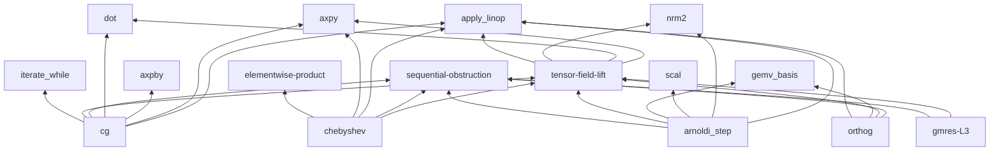
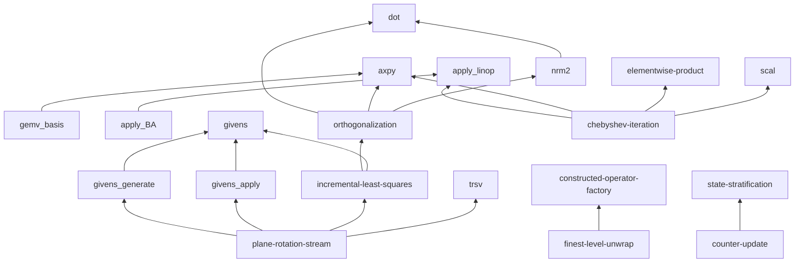
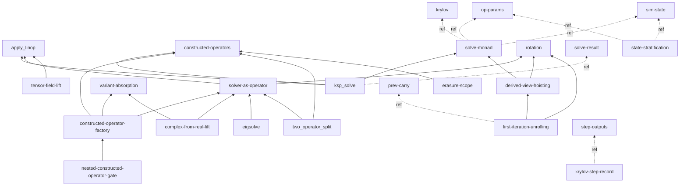

# CYCLE: concepts library index + dependency-map refresh

## Summary

Both `book/src/concepts/index.md` and `book/src/concepts/dependency-map.md` carried whole-file
**pre-redirect orchestrator/slice-era framing**:

- `index.md` — a slice-keyed "Lifecycle" recipe, a concept-file format example whose **Used by** block linked
  `../spec/slices/X.md` / `../spec/slices/Y.md` (the deleted corpus), and an Index note attributing maintenance to
  "the orchestrator: every `concept_writes mode=create`" with a `grep -l "concepts/<name>.md" book/src/spec/slices/*.md`
  recipe (the orchestrator + slice corpus are both gone — see CLAUDE.md §Repository status / §Methodology invariants
  "Phase 1 corpus was lifted and deleted").
- `dependency-map.md` — provenance attributing the map to "the Synthesizer when emitting new concept entries
  (per `prompts/synthesizer.md`)" and "the Planner positively selects … per `prompts/planner.md`" (the 6 prompted
  roles were decommissioned + `prompts/` DELETED batch-31), a `:::planned`/forward-projection node machinery keyed on
  roadmap **slice slugs**, and **six Mermaid graphs (~115 edges) keyed on DELETED slice-slug nodes**
  (`gmres`, `orthog`, `cg`, `arnoldi_step`, `chebyshev` slice variants, `gmres-L3`, `gmres-L4`,
  `plane-rotation-stream` as an L1 node, plus dangling non-concept node labels `allreduce_sum` / `copy` / `zero` /
  `extract-diagonal` / `spectrum-estimate` / `axpby` / `iterate_while` / `orthogonalize_column` for which no
  `concepts/<name>.md` exists).

This rewrites both files. `index.md` becomes a genuine concepts-library index re-anchored to the 14-agent Claude Code
pipeline + the layered L4→L0 + lowering Parts + the feature-surface spine, with concept pages framed as **data-shape /
shared-vocabulary** definitions (Kind table preserved, including the `record` Kind). `dependency-map.md`'s Mermaid graph
is re-derived to the **current concept node set** (the 51 on-disk concept pages — 53 files under
`book/src/concepts/` minus the two infra files `index.md` + `dependency-map.md` — grouped by Kind) with the deleted
slice-slug nodes removed; edges are opportunistically typed `depends-on` vs `reference` where obvious (light pass, NOT
the meta-phase-owned full typing campaign).

**CG Form-B pointer (`book/src/L4/krylov-step.md:254`)** — re-read; it already references the inline worked example
(`§Semantics §"Worked example — CG Form B"`) + `concepts/first-iteration-unrolling.md`, and mentions the old slice only
as a historical "now-deleted … absorbed here in cycle-099" note. **Not stale — no change.**

OQs resolved: `concepts-index-and-depmap-orchestrator-era-framing-refresh`,
`dependency-map-cg-precond-stale-mermaid-edges-RESCOPE-CORRECTION`.

## Proposed changes

```edit:book/src/concepts/index.md
[old]: # Concepts — Shared Library

A look-aside library of **shared primitives and abstract concepts** referenced across multiple slices. Examples of what lives here:

- Primitive tensor operators: `axpy`, `dot`, `matvec`, `outer`, `reduce`, `conv`, `unfold`, etc.
- Abstract mathematical concepts: Krylov subspace, condition number, iteration matrix, convergence rate, residual, preconditioner.
- Composite building blocks reused across solvers: Krylov-basis extension, Gram–Schmidt, Lanczos tridiagonalization.

## Why this exists

This is **both a DRY mechanism and the unification artifact** of the layered methodology:

- DRY: defining `axpy` once and referencing it from every slice that uses it means corrections propagate.
- Unification signal: when two slices' L2/L3 forms reach for the same primitive, *putting it here is what "they unify" means* concretely. Growth of this library tracks the unification depth of the spec.

## Lifecycle

Concepts are extracted **on demand**, not enumerated up front:

1. While drafting a slice's L1/L2/L3, when a primitive or concept is reached for that "feels canonical," check this index.
2. If present, link to the existing entry from the slice.
3. If not present, create a new `concepts/<name>.md` and add it to the index.
4. If a concept already here turns out to have multiple inconsistent uses across slices, that's a **push-back signal** — the concept's definition needs revision, or the slices need to converge.

## Concept file format

```markdown
# `<name>`

## Context
(optional — short orientation: what this is, where it shows up, when to reach for it)

**Signature.** `<haskell-style type or pseudo-signature>`

**Shape contract.** `<bunsen-DimExpr-style shape annotation>`

**Definition.** Prose + equations defining the operation or concept.

**Algebraic laws.** Commutativity, associativity, distributivity, etc., where applicable.

**Used by.**
- [slice X](../spec/slices/X.md)
- [slice Y](../spec/slices/Y.md)

## Working Notes
(optional — todos, ambiguities, open questions tied to this concept)
```

The `Context` and `Working Notes` sections are general agent-facing affordances available on any spec content; see `CLAUDE.md` *Pinned conventions* for the convention.

## Index

Auto-maintained by the orchestrator: every `concept_writes mode=create` adds a row here (analogous to the `SUMMARY.md` auto-register added in meta-7). `Used by` was removed in meta-15 as too expensive to keep accurate — `dependency-map.md` gives the layered cross-reference view, and `grep -l "concepts/<name>.md" book/src/spec/slices/*.md` answers the "where is this used" question reliably.

**Kind values**:
[new]: # Concepts — Shared Library

A look-aside library of **cross-cutting concept pages**: shared primitives, abstract concepts, layer patterns, and
record-definition pages referenced across **multiple chapters** of the layered specification (the L4→L0 Parts, the four
`L_{n+1}>L_n` lowering Parts, and the feature-surface spine under `book/src/feature/`). Examples of what lives here:

- Primitive tensor/linear-algebra operators referenced across layers: `axpy`, `dot`, `nrm2`, `scal`, `apply_linop`, `trsv`, …
- Abstract mathematical concepts: Krylov subspace, orthogonalization, convergence test, Givens rotation.
- Layer patterns naming how the rotations work: `state-stratification`, `solve-monad`, `tensor-field-lift`, `constructed-operators`, …
- Methodology concepts accumulated from cross-cycle friction: `rotation`, `variant-absorption`, `sequential-obstruction`, …
- **Record-definition pages** (the record-definition obligation, directive-2): the fields / types / meaning /
  construction-vs-run-time stratum / L0 backing home of a record named across ≥2 chapters (`krylov`, `op-params`,
  `sim-state`, `step-outputs`, `prev-carry`, `solve-result`, `config-record`).

A concept page defines the **data shape / shared vocabulary** in itself; the per-operator chapters (in the L_n Parts)
define the *behavior over it*. A concept page does NOT restate the operators' algebra — the authoritative algebra lives
in the L_n operator entry, and the concept page forwards to it.

## Why this exists

This is **both a DRY mechanism and the unification artifact** of the layered methodology:

- DRY: defining `axpy` once and referencing it from every chapter that uses it means corrections propagate.
- Unification signal: when two layered chapters' forms reach for the same primitive, *putting it here is what "they
  unify" means* concretely. Growth of this library tracks the unification depth of the spec.

## Lifecycle

Concepts are extracted **on demand** by the specialized dispatch agents (primarily `layer-intro-author` for
cross-cutting concept + record-definition pages; the `harvester` flags a signature-named record needing a home), not
enumerated up front:

1. While authoring an L_n operator entry, a lowering theme, or a feature-surface column, a primitive / pattern / record
   is reached for that "feels canonical" and is referenced across ≥2 chapters — check this index.
2. If present, link to the existing concept page from the chapter.
3. If not present, a `layer-intro-author` dispatch authors a new `concepts/<name>.md` (one page per invocation) and the
   integrator adds it to the index in alpha position. A record used by only ONE chapter stays layer-local (an in-chapter
   `## Record definition` section), below the ≥2-consumer bar.
4. If a concept already here turns out to have multiple inconsistent uses across chapters, that's a **push-back signal**
   surfaced by the `same-layer-cross-cutter` / `cross-layer-cross-cutter` agents — the concept's definition needs
   revision, or the chapters need to converge.

## Concept file format

```markdown
# `<name>`

## Context
(optional — short orientation: what this is, where it shows up, when to reach for it)

**Signature.** `<Haskell `::` type or pseudo-signature>`  (records use the TS brace form `{ field: type }`)

**Shape contract.** `<bunsen-DimExpr-style named-axis shape annotation>`

**Definition.** Prose + equations defining the operation, concept, or record data-shape. (A concept page does NOT
restate the operators' algebraic laws — those live in the authoritative L_n operator entry, forwarded to from here.)

**Referenced by.**
- [`<chapter>`](../L<n>/<chapter>.md)
- [`<feature column>`](../feature/<name>.L<n>.md)

## Working Notes
(optional — todos, ambiguities, open questions tied to this concept)
```

The `Context` and `Working Notes` sections are general agent-facing affordances available on any chapter content.

## Index

Maintained by the integrator: a new `concepts/<name>.md` page lands as an alpha-positioned row here. The per-page
"referenced by" enumeration is not kept in this table (too expensive to keep accurate) —
`dependency-map.md` gives the layered cross-reference view, and `grep -rl "concepts/<name>.md" book/src/` answers the
"where is this used" question reliably across the L_n Parts, lowering Parts, and the feature spine.

**Kind values**:
```

```edit:book/src/concepts/index.md
[old]: - `algorithm` — top-level algorithmic patterns (gmres, chebyshev-iteration, orthogonalization, …).
[new]: - `algorithm` — algorithmic patterns above the leaf primitives (chebyshev-iteration, orthogonalization, incremental-least-squares, …).
```

```edit:book/src/concepts/dependency-map.md
[old]: # Concept dependency map

Per-layer map of concepts in `book/src/concepts/`. Maintained by the Synthesizer when emitting new concept entries (per `prompts/synthesizer.md` *Build vocabulary bottom-up*); future markers added by the Synthesizer/Meta-Critic when planning pipeline work.

The map serves three purposes:

- **Bottom-up vocabulary.** Support-operator concepts at L1 give the vocabulary to describe complex L1 slices concisely; L2 algebraic decompositions give the vocabulary for L2 slices, etc. Reading the map answers "what primitives does this layer have available?"
- **Cross-cutting framework discovery.** Methodology concepts (rotation, variant-absorption, constructed-operators) accumulate from cross-cycle friction integration. Reading the map answers "what methodology tools does the loop have available for handling cross-cutting concerns?"
- **Forward projection** (added 2026-05-25 from user directive). The map also includes mechanisms that have NOT YET been provided — concepts and slices the roadmap names as in-scope but the loop hasn't extracted yet. These appear as **planned nodes** styled with `:::planned` (dashed outline). Reading the map this way answers "what's coming next, and which existing concepts will it build on?"

**Node style convention:**

- Solid-outline nodes are on-disk concepts (a file exists at `book/src/concepts/<name>.md`).
- Dashed-outline nodes (`:::planned`) are future markers — items from `scaffolding/roadmap.md` not yet extracted. They depend on existing concepts via solid edges; their own placement names where they will sit in the layer hierarchy when extracted.
- An edge from a `:::planned` node to an existing concept is a *forward commitment*: when this concept is extracted, it will build on these existing primitives.
- An edge between two `:::planned` nodes is a *planned-pipeline edge*: both are future markers and the dependency is anticipated.

The scaffolding WIP version at `scaffolding/concept-dependency-map.md` tracks pending extractions and hypothetical concepts that aren't yet stable enough for the book.
[new]: # Concept dependency map

Dependency map of the concept pages in `book/src/concepts/`. Maintained by the integrator when a `layer-intro-author`
dispatch lands a new concept page: the **same diff** that adds `concepts/<name>.md` adds its node + edges here.

The map serves two purposes:

- **Bottom-up vocabulary.** Leaf primitives (`axpy`, `dot`, `nrm2`, `scal`, `apply_linop`, `trsv`, …) give the
  vocabulary to describe the layered chapters concisely; the layer patterns and algorithms compose them. Reading the map
  answers "what shared vocabulary is available, and what does each concept rest on?"
- **Cross-cutting framework discovery.** Methodology concepts (`rotation`, `variant-absorption`,
  `constructed-operators`, `sequential-obstruction`) accumulate from cross-cycle friction integration. Reading the map
  answers "what methodology tools does the pipeline have for handling cross-cutting concerns?"

**Edge convention** (light typing; the meta-phase-owned graded-stack full typing pass is authoritative):

- A solid edge `A --> B` is a **`depends-on`** edge — concept `A` is *defined in terms of* concept `B` (B is the
  more-primitive dependency). Every node is an on-disk page (`book/src/concepts/<name>.md` exists).
- An edge annotated `-.->|ref|` is a **`reference`** (navigational see-also) edge — `A` mentions `B` for orientation but
  is not defined in terms of it.

Every node below corresponds to an on-disk concept page. The forward-projection `:::planned` machinery (roadmap-slice
markers) was retired with the Phase-1 slice corpus (deleted cycles 097/098/099); planned/speculative vocabulary now
lands as rank-0 `roadmap_goal` book chapters in the L_n Parts (graded resolution ladder), not as dashed nodes here.
The scaffolding WIP version at `scaffolding/concept-dependency-map.md` tracks pending extractions and hypothetical
concepts not yet stable enough for the book.
```

```edit:book/src/concepts/dependency-map.md
[old]: ## Intermediate-tier algorithms (planned — roadmap)

Algorithmic primitives that sit between leaf primitives (axpy, dot, …) and top-level driver algorithms (CG, GMRES, …). Currently all dashed-outline (planned); none yet extracted. See `scaffolding/roadmap.md` *Intermediate-tier algorithms* for impact ranking. The Planner positively selects from this tier per `prompts/planner.md` Forward-frontier criterion.

```mermaid
graph BT
  arnoldi-step:::planned --> apply_linop
  arnoldi-step:::planned --> orthogonalization
  arnoldi-step:::planned --> dot
  arnoldi-step:::planned --> axpy
  arnoldi-step:::planned --> nrm2

  plane-rotation-stream:::planned --> givens
  plane-rotation-stream:::planned --> incremental-least-squares

  polynomial-recurrence-step:::planned --> axpy
  polynomial-recurrence-step:::planned --> elementwise-product
  polynomial-recurrence-step:::planned --> scal

  sparse-triangular-solve:::planned --> trsv

  diagonal-preconditioner-apply:::planned --> elementwise-product

  residual-update:::planned --> apply_linop
  residual-update:::planned --> axpy

  restart-machinery:::planned --> state-stratification
  restart-machinery:::planned --> solve-monad

  %% Future top-level slices that consume intermediates:
  minres:::planned --> arnoldi-step:::planned
  minres:::planned --> plane-rotation-stream:::planned
  eigenmode:::planned --> arnoldi-step:::planned
  eigenmode:::planned --> plane-rotation-stream:::planned
  bicgstab:::planned --> residual-update:::planned
  jacobi:::planned --> diagonal-preconditioner-apply:::planned
  jacobi:::planned --> polynomial-recurrence-step:::planned
  ilu:::planned --> sparse-triangular-solve:::planned
  gauss-seidel:::planned --> sparse-triangular-solve:::planned
  ams:::planned --> sparse-triangular-solve:::planned
  ams:::planned --> diagonal-preconditioner-apply:::planned
  multigrid-v-cycle:::planned --> restart-machinery:::planned

  %% Existing concepts that intermediates reuse (already on disk):
  apply_linop
  axpy
  dot
  nrm2
  scal
  givens
  trsv
  elementwise-product
  orthogonalization
  incremental-least-squares
  state-stratification
  solve-monad

  classDef planned stroke-dasharray: 5 5,stroke:#888,fill:#fafafa;
```



## L1 — mutation-lifted primitives

Pure-functional re-expressions of in-place mutations from source. Each concept names: signature, input/output sets, mutation pattern observed in source.

(Empty as of 2026-05-23. Will populate as the agent loop's Synthesizer extracts support-operator concepts from slice work. Expected initial candidates from CG/GMRES, per BOOTSTRAP verification rubric: `axpy`, `dot`, `matvec`, `apply_linop`, `norml2`. From GMRES specifically: `arnoldi_step`, `givens_rotation`, `hessenberg_extend`.)



## L2 — algebraic decompositions



Composition of base algebraic primitives, with HPC/SIMD tricks unfolded.

(Empty as of 2026-05-23. Will populate as L1→L2 rotations land.)
s L1→L2 rotations land.)

## L3 — global tensor-field operations



Whole-tensor operations replacing per-element iteration; or `obstruction` results documenting genuine sequentiality.

(Empty as of 2026-05-23. Will populate as L2→L3 rotations land. Expect Krylov outer loops and Arnoldi orthogonalization to be obstructions, not lifts.)
bstructions, not lifts.)

## L4 — formal calculus terms

```mermaid
graph BT
  solve-monad --> state-stratification
  solve-monad --> constructed-operators
  solve-monad --> sequential-obstruction
  gmres-L4 --> state-stratification
  gmres-L4 --> solve-monad
  gmres-L4 --> constructed-operators
  gmres-L4 --> variant-absorption
  gmres-L4 --> sequential-obstruction
  gmres --> state-stratification
  gmres --> solve-monad
  gmres --> constructed-operators
  gmres --> variant-absorption
  gmres --> sequential-obstruction
  state-stratification --> constructed-operators
  state-stratification --> variant-absorption
  state-stratification --> sequential-obstruction
  convergence-test --> constructed-operators
  convergence-test --> variant-absorption
  convergence-test --> solve-monad
  gmres --> convergence-test
  orthog --> state-stratification
  orthog --> solve-monad
  orthog --> constructed-operators
  orthog --> sequential-obstruction
  chebyshev --> solve-monad
  chebyshev --> state-stratification
  chebyshev --> constructed-operators
  chebyshev --> apply_linop
  chebyshev --> tensor-field-lift
  chebyshev --> sequential-obstruction
  chebyshev --> axpy
  chebyshev --> elementwise-product
  chebyshev --> spectrum-estimate
  arnoldi_step --> solve-monad
  arnoldi_step --> state-stratification
  arnoldi_step --> derived-view-hoisting
  arnoldi_step --> variant-absorption
  arnoldi_step --> sequential-obstruction
  arnoldi_step --> apply_linop
  arnoldi_step --> orthogonalization
  arnoldi_step --> nrm2
  arnoldi_step --> scal
  cg --> first-iteration-unrolling
  gmres --> derived-view-hoisting
  chebyshev --> derived-view-hoisting
```



The L4 calculus has its own design artifact at [`book/src/design/l4_calculus.md`](../design/l4_calculus.md). L4 concepts (grammar productions, reduction rules, ownership categories) are not currently tracked here — the calculus is a single document with its own internal structure. If L4 grows to need cross-cycle concept tracking, add a section here at that time.
[new]: ## Primitives + algorithms (leaf vocabulary)

Leaf tensor/linear-algebra primitives and the algorithm-tier concepts built directly on them. Each node is an on-disk
concept page; the more-primitive dependency sits at the arrow head (`graph BT`, bottom = most primitive).



Leaf primitives with no concept-level dependency (referenced widely across the L_n Parts) appear as bare nodes:
`axpy`, `dot`, `scal`, `apply_linop`, `trsv`, `elementwise-product`, `set_subvector_zero`,
`givens`, `gemv_basis`, `scalar-promotion`.

## Layer patterns + records

How the layers' rotations are organized (`layer-pattern` Kind) and the record data-shapes (`record` Kind) they thread.
The record pages are leaves here (data-shape definitions); the layer patterns that consume them carry `reference` edges
to them.



The `record` Kind pages (`krylov`, `op-params`, `sim-state`, `step-outputs`, `prev-carry`, `solve-result`,
`config-record`) are data-shape definitions — they sit at the leaves (a record is *defined by* its fields, it does not
depend on the operators that thread it). The layer patterns above reference them with `-.->|ref|` edges. The
`krylov-step-record` node above is the `state-stratification` worked example's record bundle; it is the on-disk
`krylov` page (alias kept readable for the edge).

## L4 calculus + feature spine (tracked elsewhere)

The methodology primitives applicable across all layers are in the `## Methodology concepts (cross-layer)` section
above (the single methodology sub-graph — not duplicated here).

The L4 calculus has its own design artifact at [`book/src/design/l4_calculus.md`](../design/l4_calculus.md). L4 grammar
productions, reduction rules, and ownership categories are not tracked here — the calculus is a single document with its
own internal structure. The feature-surface spine (`book/src/feature/`) composes these concepts into entry-point
columns; those compositions are tracked in the per-column chapters + `feature/index.md`, not duplicated here.
```

```edit:book/src/concepts/dependency-map.md
[old]: ## Maintenance protocol

When the Synthesizer emits a slice diff that introduces a new concept entry, the **same diff** must update this dependency map. Specifically:

1. **Add the new concept** under its appropriate layer subsection above.
2. **List its dependencies** — the other concepts (at the same layer or below) it references in its body.
3. **Update the mermaid graph** for that layer to reflect the new node and edges.

A concept entry that exists in `book/src/concepts/` but is not represented in this map fails the slice-acceptance criteria — it's structurally orphaned. The Critic's check #N (to be added when friction warrants enforcement) verifies that every concept page has a corresponding map entry and that declared dependencies match body references.

The scaffolding version at `scaffolding/concept-dependency-map.md` is the workshop where:
- Pending concept extractions are sketched before they stabilize.
- Cross-cutting dependencies the Meta-Critic notices but hasn't yet incorporated are tracked.
- Hypothetical concepts ("we'll need something like X eventually") are listed for future cycles to act on.

## Origin

Introduced 2026-05-23 by user direction during the same conversation as the apply-on-revise methodology fix and the constructed-operators concept. The map is the artifact that operationalizes the "build vocabulary bottom-up" principle from `prompts/synthesizer.md` and CLAUDE.md *Process* #5.
[new]: ## Maintenance protocol

When a `layer-intro-author` dispatch introduces a new concept page, the **same proposed-changes diff** must update this
dependency map. Specifically:

1. **Add the new concept** under its appropriate sub-graph above (primitives+algorithms / layer-patterns+records /
   methodology).
2. **List its dependencies** — the other concept pages it is *defined in terms of* (`depends-on`, solid edge) and the
   ones it merely cross-references (`reference`, `-.->|ref|` edge).
3. **Update the mermaid graph** to reflect the new node and edges.

A concept page that exists in `book/src/concepts/` but is not represented in this map is structurally orphaned. The
graded-stack reachability linter (`tools/`, mark-sweep from the feature-surface roots) is the authoritative orphan
check; a concept reachable only here but not from any chapter is a GC candidate.

The scaffolding version at `scaffolding/concept-dependency-map.md` is the workshop where:
- Pending concept extractions are sketched before they stabilize.
- Cross-cutting dependencies the meta-phase notices but hasn't yet incorporated are tracked.
- Hypothetical concepts ("we'll need something like X eventually") are listed for future cycles to act on.

## Origin

Introduced 2026-05-23 to operationalize the "build vocabulary bottom-up" principle (CLAUDE.md §Bunsen methodology
conventions). Re-derived to the post-redirect artifact state in cycle-101 (the Phase-1 slice corpus + the pre-redirect
orchestrator/`prompts/` roles were retired and deleted; the Mermaid node set is re-anchored to the on-disk concept
pages).
```

## Supporting evidence

- Current on-disk concept pages: 51 concept pages (53 files under `book/src/concepts/` minus the two infra files
  `index.md` + `dependency-map.md`; the §Index table's 51 rows are in sync with the concept-page set;
  `apply_BA`, `apply_linop`, `axpy`, `dot`, `nrm2`, `scal`, `trsv`, `elementwise-product`,
  `set_subvector_zero`, `givens` / `givens_apply` / `givens_generate`, `gemv_basis`, `orthogonalization`,
  `incremental-least-squares`, `plane-rotation-stream`, `chebyshev-iteration`, `finest-level-unwrap`, `counter-update`,
  `ksp_solve`, `solve-monad`, `state-stratification`, `tensor-field-lift`, `solver-as-operator`,
  `constructed-operator-factory`, `nested-constructed-operator-gate`, `complex-from-real-lift`, `eigsolve`,
  `two_operator_split`, `erasure-scope`, `derived-view-hoisting`, `first-iteration-unrolling`, `convergence-test`,
  `scalar-promotion`, plus the 7 `record` pages `krylov` / `op-params` / `sim-state` / `step-outputs` / `prev-carry` /
  `solve-result` / `config-record`, plus the methodology pages `rotation` / `variant-absorption` /
  `constructed-operators` / `sequential-obstruction` / `capability-typing` / `negative-result-slice` /
  `scope-out-obstruction` / `black-box-vs-accelerated-kernels`).
- Deleted slice-slug Mermaid nodes removed from the dep-map: `gmres`, `orthog`, `cg`, `arnoldi_step`, `chebyshev`
  (slice variant), `gmres-L3`, `gmres-L4`, `plane-rotation-stream` (as an L1 node — kept only as the on-disk concept),
  and the dangling non-concept node labels `allreduce_sum`, `copy`, `zero`, `extract-diagonal`, `spectrum-estimate`,
  `axpby` (concept page is at L2/L3 not concepts/), `reciprocal` (operator chapter is at L1/L2/L3 not concepts/),
  `iterate_while`, `orthogonalize_column`, `placeholder`,
  plus the entire `:::planned` roadmap-slice forward-projection block (`minres` / `bicgstab` / `jacobi` / `ilu` /
  `gauss-seidel` / `ams` / `multigrid-v-cycle` / `arnoldi-step` / `polynomial-recurrence-step` /
  `sparse-triangular-solve` / `diagonal-preconditioner-apply` / `residual-update` / `restart-machinery`).
- CLAUDE.md §Repository status + §Methodology invariants "Phase 1 corpus was lifted and deleted" (corpus 9→0,
  cycles 097/098/099; `book/src/spec/` no longer exists).
- CLAUDE.md §Repository status "Decommissioned + DELETED (batch-31): the pre-redirect Python orchestrator
  (`orchestrator/`), `prompts/`, `schemas/`, legacy ledgers" — the `prompts/synthesizer.md` / `prompts/planner.md`
  provenance these files cited no longer exists.
- `book/src/L4/krylov-step.md:254` — re-read; the CG Form-B pointer already references the inline worked example +
  `concepts/first-iteration-unrolling.md` and frames the slice only as a "now-deleted … absorbed cycle-099" history
  note. No change.

## Open questions / caveats

- **Light typing only.** I annotated `depends-on` (solid) vs `reference` (`-.->|ref|`) edges where the relationship was
  obvious (record pages as leaves referenced by the layer patterns that thread them). This is NOT the meta-phase-owned
  graded-stack full edge-typing campaign (`project_graded_stack_directive`, priorities item 0) — that pass will type
  every edge in the artifact and run the two linters. The dep-map's edge set should be reconciled with that campaign
  when it lands; flagging so it is not mistaken for the authoritative typed graph.
- The §Index Kind table was left intact (its 51 rows are already in sync with the 51 on-disk concept pages and
  alpha-ordered). Only the
  `algorithm` Kind one-liner was de-slice-ified (dropped the `gmres` example, which is no longer a concept page).
- The methodology sub-graph (lines 24-56 in the original) is unchanged and remains the authoritative methodology graph;
  the re-derived "Layer patterns + records" sub-graph references the methodology nodes but does not duplicate that graph.
- No markdown links to deleted files were present outside the fenced format-example block (lines 42-43, now removed);
  the build stays green (Mermaid node labels are not link targets, and all bulleted prose links — `rotation`,
  `variant-absorption`, `constructed-operators`, `design/l4_calculus.md` — resolve to existing files).
