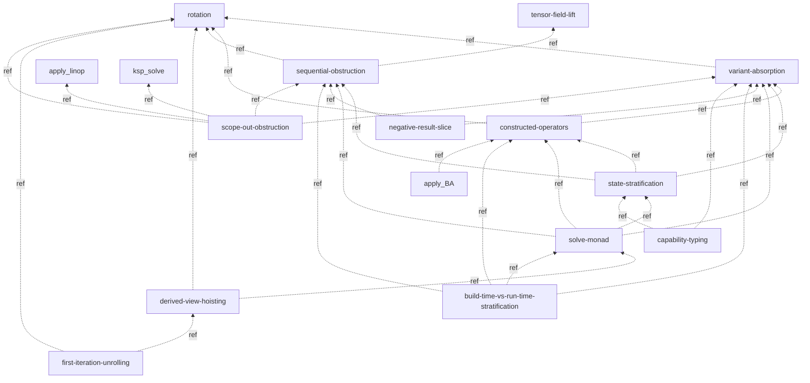
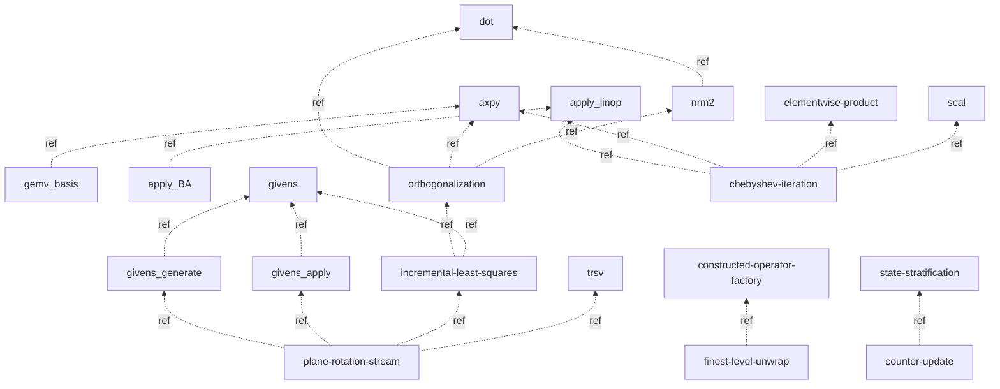
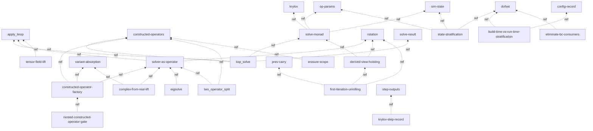

# CYCLE: typed `edges:` + reconciled typed graph for the concepts/ infra pair

## Summary

Cycle-103 D4, WAVE 2 of the graded-stack typed-edge campaign (P1). Types and
reconciles the artifact's canonical edge-declaration *infra* pair:

1. **`concepts/index.md`** — typed as a **navigational container** (the SAME
   convention WAVE-1 D5 fixed for the layer/lowering indexes): `kind:
   navigational-container (concepts library index)`, `edges: reference:`-only to
   its member concept pages, **NO `rank:`**. The new `concepts/dofset.md` (D7) is
   added to its member set (the index "Index" table gets the alpha-positioned
   `dofset` row; SUMMARY wiring is D7's, not duplicated here).
2. **`concepts/dependency-map.md`** — re-derived so its typed graph is consistent
   with the per-page `edges:` blocks the WAVE-1 dispatches (D1/D2/D3) authored +
   the new `dofset` record node (D7). This RECONCILES the c101 D2 LIGHT in-prose
   edge-typing pass (OQ recorded c101) against the authoritative per-page typing:
   the load-bearing change is that the WAVE-1 finding "**a non-record concept
   page emits ONLY `reference` edges (0 `depends-on`)**" means nearly every solid
   `-->` (depends-on) edge in the c101 map is now a `reference` edge. The map is
   re-typed to match, the `dofset` record node is added, and the dependency-map
   is itself typed as a navigational container (it is a meta-page about the
   construction, not a DAG node — same as the index).

**The dependency-map is the canonical edge-declaration *home* in prose, but it is
NOT the machine-authoritative edge surface** — under the graded-stack scheme the
authoritative typed edges live in each chapter's `edges:` frontmatter (scheme §2,
§4(b): "the authoritative edge set moves to per-chapter `edges:` frontmatter; the
prose dep-map table becomes a *derived human-readable view* (it may lag, like the
index status cells)"). So this re-derivation makes the human-readable map a
faithful *mirror* of the per-page frontmatter; the per-page blocks win on any
future drift.

## Node-status convention applied + divergence flagged (for batch-close meta-phase unify)

**Convention adopted (aligned with D5):** an **index / dependency-map / container
page is a navigational CONTAINER, not a vocabulary DAG node** — no `rank:`,
`edges: reference:`-only, `kind: navigational-container`. `concepts/index.md` is
this by the identical argument D5 makes (it indexes the concept library and makes
no resolution claim); `concepts/dependency-map.md` is *also* this (a meta-page
*about* the concept graph — scheme §2d's "documents the construction" case, like
`graded-stack-scheme.md` itself). **This is exactly the alignment point D5
flagged** ("ensure `concepts/index` takes the **same** container treatment as the
layer indexes … a divergence to reconcile if D4 ranks it") — I do NOT rank either
infra page; convention agrees. No divergence on the index/container half.

**Divergence I observed and am flagging (NOT mine to resolve — concept-PAGE half,
D1/D2/D3's surface):** the three concept-cluster dispatches did NOT converge on the
encoding for *non-node* (non-record) concept pages:

- **D1 (cluster A) + D3 (cluster C):** non-node concept pages get a written-to-disk
  `edges: reference:`-only block, **no `rank:`** (typed edges, no rank — "strictly
  more information than omitting frontmatter").
- **D2 (cluster B):** non-node concept pages get **NO frontmatter at all** (visited
  + classified in a table, not written to disk); only the `config-record` *record*
  page gets `rank:` + `edges:`.

Both agree on the *node-status* (non-record concept page = NOT a DAG node, no
`rank:`) and on the record-page treatment (record = DAG node, `rank:` + typed
edges incl. `cites-evidence depends-on` to L0). They differ ONLY on whether a
non-node page carries a written `reference`-only `edges:` block (D1/D3: yes; D2:
no). **This does not affect my infra reconciliation** — the dependency-map mirror
is identical either way (a non-node page contributes only `reference` edges to the
map regardless of whether those edges are also written as its own frontmatter).
I record it for the meta-phase to unify the concept-PAGE encoding at batch close
(OQ `graded-stack-concept-nonnode-edges-block-d1d3-vs-d2`). My infra pages adopt
the D1/D3/D5 "write the typed `reference` block" posture (consistent with D5's
containers), since the container convention D5 fixed writes the block.

## Proposed changes

### (1) `concepts/index.md` — navigational-container frontmatter + add `dofset` to the member table

```edit:book/src/concepts/index.md
[old]:
# Concepts — Shared Library
[new]:
---
kind: navigational-container (concepts library index)
# Navigational container, not a DAG node: no `rank:` (makes no resolution
# claim, not in the total order), only `reference` edges to the concept pages
# it indexes (carry no liveness, constrain no rank — scheme §4/§5; SAME
# convention WAVE-1 D5 fixed for the layer/lowering indexes). The record-
# definition concept pages it lists (config-record / dofset / krylov / op-params
# / sim-state / step-outputs / prev-carry / solve-result) ARE DAG nodes — but a
# member being a node does not make the index a node (an index references its
# members; it does not depend-on them).
edges:
  reference:
    - concepts/dependency-map
    - concepts/apply_BA
    - concepts/apply_linop
    - concepts/axpy
    - concepts/black-box-vs-accelerated-kernels
    - concepts/build-time-vs-run-time-stratification
    - concepts/capability-typing
    - concepts/chebyshev-iteration
    - concepts/complex-from-real-lift
    - concepts/config-record
    - concepts/constructed-operator-factory
    - concepts/constructed-operators
    - concepts/convergence-test
    - concepts/counter-update
    - concepts/derived-view-hoisting
    - concepts/dofset
    - concepts/dot
    - concepts/eigsolve
    - concepts/elementwise-product
    - concepts/erasure-scope
    - concepts/finest-level-unwrap
    - concepts/first-iteration-unrolling
    - concepts/gemv_basis
    - concepts/givens
    - concepts/givens_apply
    - concepts/givens_generate
    - concepts/gmres
    - concepts/incremental-least-squares
    - concepts/krylov
    - concepts/ksp_solve
    - concepts/negative-result-slice
    - concepts/nested-constructed-operator-gate
    - concepts/nrm2
    - concepts/op-params
    - concepts/orthogonalization
    - concepts/plane-rotation-stream
    - concepts/prev-carry
    - concepts/rotation
    - concepts/scal
    - concepts/scalar-promotion
    - concepts/scope-out-obstruction
    - concepts/sequential-obstruction
    - concepts/set_subvector_zero
    - concepts/sim-state
    - concepts/solve-monad
    - concepts/solve-result
    - concepts/solver-as-operator
    - concepts/state-stratification
    - concepts/step-outputs
    - concepts/tensor-field-lift
    - concepts/trsv
    - concepts/two_operator_split
    - concepts/variant-absorption
---

# Concepts — Shared Library
```

Add the `dofset` row to the index's "Index" table in alpha position (between
`derived-view-hoisting` and `dot`), so the index's member table matches its typed
member set + the SUMMARY (D7) wiring:

```edit:book/src/concepts/index.md
[old]: | [derived-view-hoisting](./derived-view-hoisting.md) | layer-pattern |
| [dot](./dot.md) | primitive |
[new]: | [derived-view-hoisting](./derived-view-hoisting.md) | layer-pattern |
| [dofset](./dofset.md) | record |
| [dot](./dot.md) | primitive |
```

### (2) `concepts/dependency-map.md` — navigational-container frontmatter + re-derived typed graph

Replace the H1 with frontmatter + H1:

```edit:book/src/concepts/dependency-map.md
[old]:
# Concept dependency map
[new]:
---
kind: navigational-container (concept dependency-map; derived view)
# Navigational container / meta-page about the construction, NOT a DAG node:
# no `rank:`. This page is a DERIVED human-readable mirror of the per-chapter
# `edges:` frontmatter (scheme §4(b)) — the authoritative typed edges live on the
# concept pages themselves; this map may lag, the per-page blocks win on drift.
# Its own `edges:` are `reference`-only to the concept pages it visualizes.
edges:
  reference:
    - concepts/index
---

# Concept dependency map
```

Re-derive the edge-convention note + the three sub-graphs so the typed graph
matches the per-page `edges:` blocks (WAVE-1 D1/D2/D3 + D7). The load-bearing
re-typing: a non-record concept page emits **only `reference` edges** (WAVE-1
finding) — so the c101 solid `-->` edges become `-.->|ref|`; the record pages are
DAG-node leaves whose only blocking (`depends-on`) edges go to raw L0 source
(`kind: cites-evidence`, off this concept-graph), shown as a note.

```edit:book/src/concepts/dependency-map.md
[old]: **Edge convention** (light typing; the meta-phase-owned graded-stack full typing pass is authoritative):

- A solid edge `A --> B` is a **`depends-on`** edge — concept `A` is *defined in terms of* concept `B` (B is the
  more-primitive dependency). Every node is an on-disk page (`book/src/concepts/<name>.md` exists).
- An edge annotated `-.->|ref|` is a **`reference`** (navigational see-also) edge — `A` mentions `B` for orientation but
  is not defined in terms of it.

Every node below corresponds to an on-disk concept page. The forward-projection `:::planned` machinery (roadmap-slice
markers) was retired with the Phase-1 slice corpus (deleted cycles 097/098/099); planned/speculative vocabulary now
lands as rank-0 `roadmap_goal` book chapters in the L_n Parts (graded resolution ladder), not as dashed nodes here.
The scaffolding WIP version at `scaffolding/concept-dependency-map.md` tracks pending extractions and hypothetical
concepts not yet stable enough for the book.
[new]: **Edge convention** (graded-stack typed — re-derived cycle-103 P1 against the per-page `edges:` frontmatter,
reconciling the c101 LIGHT in-prose typing pass; the **per-chapter `edges:` blocks are authoritative**, this map is the
derived mirror, scheme §2/§4(b)):

- A dashed edge `A -.->|ref| B` is a **`reference`** (navigational see-also) edge — `A` mentions/points-at `B` for
  orientation, but does not *rest on* it in the well-foundedness sense (constrains no rank, carries no liveness).
- A solid edge `A --> B` is a **`depends-on`** edge — blocking: `A`'s rank is bounded by `B`'s, and `B` is kept live by
  `A`'s reachability.

**The load-bearing typing fact (re-derived this pass).** Per the WAVE-1 typed-edge campaign (D1/D2/D3): a concept page
that is a **narrative-pointer / methodology / layer-pattern** page sits **outside the subject DAG** (scheme §2d, §5) —
it is NOT a ranked node, and **every edge it emits is `reference`** (it points the reader at the firm L_n home; the
blocking rank flows the OTHER way, carried by that L_n entry's own `depends-on` block, not by the concept page). So the
overwhelming majority of edges below are `-.->|ref|`. The **only** concept pages that are DAG nodes are the
**`record` Kind** pages (`config-record`, `dofset`, `krylov`, `op-params`, `sim-state`, `step-outputs`, `prev-carry`,
`solve-result`); a record page is a leaf whose only **`depends-on`** edges are `kind: cites-evidence` edges to its raw
L0 backing struct (`palace/...:lines`) — those targets are OFF this concept-graph (L0 source, not concept pages), so a
record node appears here as a **leaf** that layer-pattern pages `-.->|ref|` into. (The c101 map drew these relations as
solid `-->`; that over-asserted blocking dependence among non-node pages — the reconciliation re-types them `ref`.)

Every node below corresponds to an on-disk concept page. The forward-projection `:::planned` machinery (roadmap-slice
markers) was retired with the Phase-1 slice corpus (deleted cycles 097/098/099); planned/speculative vocabulary now
lands as rank-0 `roadmap_goal` book chapters in the L_n Parts (graded resolution ladder), not as dashed nodes here.
The scaffolding WIP version at `scaffolding/concept-dependency-map.md` tracks pending extractions and hypothetical
concepts not yet stable enough for the book.
```

Re-type the methodology sub-graph (all non-node pages → `reference` edges):

```edit:book/src/concepts/dependency-map.md
[old]: ```mermaid
graph BT
  variant-absorption --> rotation
  constructed-operators --> rotation
  constructed-operators --> variant-absorption
  sequential-obstruction --> rotation
  sequential-obstruction --> tensor-field-lift
  state-stratification --> variant-absorption
  state-stratification --> constructed-operators
  state-stratification --> sequential-obstruction
  solve-monad --> state-stratification
  solve-monad --> sequential-obstruction
  solve-monad --> constructed-operators
  solve-monad --> variant-absorption
  derived-view-hoisting --> rotation
  derived-view-hoisting --> solve-monad
  negative-result-slice --> sequential-obstruction
  negative-result-slice --> variant-absorption
  build-time-vs-run-time-stratification --> constructed-operators
  build-time-vs-run-time-stratification --> variant-absorption
  build-time-vs-run-time-stratification --> solve-monad
  build-time-vs-run-time-stratification --> sequential-obstruction
  first-iteration-unrolling --> rotation
  first-iteration-unrolling --> derived-view-hoisting
  apply_BA --> constructed-operators
  capability-typing --> state-stratification
  capability-typing --> variant-absorption
  scope-out-obstruction --> variant-absorption
  scope-out-obstruction --> sequential-obstruction
  scope-out-obstruction --> rotation
  scope-out-obstruction --> apply_linop
  scope-out-obstruction --> ksp_solve
```
[new]: All edges below are `reference` (`-.->|ref|`): every node is a methodology /
layer-pattern concept page — outside the subject DAG (scheme §2d/§5), so it
points-at its peers/primitives but does not `depends-on` them.


```

Re-type the primitives+algorithms sub-graph:

```edit:book/src/concepts/dependency-map.md
[old]: ```mermaid
graph BT
  nrm2 --> dot
  gemv_basis --> axpy
  apply_BA --> apply_linop
  givens_apply --> givens
  givens_generate --> givens
  orthogonalization --> dot
  orthogonalization --> axpy
  orthogonalization --> nrm2
  incremental-least-squares --> orthogonalization
  incremental-least-squares --> givens
  plane-rotation-stream --> givens_generate
  plane-rotation-stream --> givens_apply
  plane-rotation-stream --> incremental-least-squares
  plane-rotation-stream --> trsv
  chebyshev-iteration --> apply_linop
  chebyshev-iteration --> axpy
  chebyshev-iteration --> elementwise-product
  chebyshev-iteration --> scal
  finest-level-unwrap --> constructed-operator-factory
  counter-update --> state-stratification
```
[new]: All edges below are `reference` (`-.->|ref|`): these are narrative-pointer
primitive/algorithm concept pages (each points at its authoritative L_n operator
entry; the blocking rank lives on that L_n entry, not on the concept page). A
`concepts/nrm2` page does not `depends-on` `concepts/dot` — it *references* it;
`L1/nrm2`'s own `edges:` block carries any real blocking dependence.


```

Re-type the layer-patterns+records sub-graph + add the `dofset` record node:

```edit:book/src/concepts/dependency-map.md
[old]: ```mermaid
graph BT
  ksp_solve --> apply_linop
  ksp_solve --> constructed-operators
  ksp_solve --> solve-monad
  solver-as-operator --> apply_linop
  solver-as-operator --> rotation
  constructed-operator-factory --> constructed-operators
  constructed-operator-factory --> variant-absorption
  constructed-operator-factory --> solver-as-operator
  nested-constructed-operator-gate --> constructed-operator-factory
  complex-from-real-lift --> solver-as-operator
  complex-from-real-lift --> variant-absorption
  eigsolve --> solver-as-operator
  two_operator_split --> constructed-operators
  two_operator_split --> solver-as-operator
  erasure-scope --> constructed-operators
  derived-view-hoisting --> rotation
  derived-view-hoisting --> solve-monad
  first-iteration-unrolling --> rotation
  first-iteration-unrolling --> derived-view-hoisting
  tensor-field-lift --> apply_linop
  solve-monad -.->|ref| krylov
  solve-monad -.->|ref| op-params
  solve-monad -.->|ref| sim-state
  ksp_solve -.->|ref| solve-result
  state-stratification -.->|ref| op-params
  state-stratification -.->|ref| sim-state
  first-iteration-unrolling -.->|ref| prev-carry
  krylov-step-record -.->|ref| step-outputs
```
[new]: All edges below are `reference` (`-.->|ref|`). The layer-pattern pages point at
the primitives/peers they organize and at the **record** Kind pages they thread;
none is a blocking `depends-on` from a concept page (the blocking edges live on
the operator/feature chapters, scheme §2d/§5). The `record` nodes (`krylov`,
`op-params`, `sim-state`, `step-outputs`, `prev-carry`, `solve-result`,
`config-record`, `dofset`) are DAG-node **leaves** here — their only `depends-on`
edges are `kind: cites-evidence` to raw L0 source (off this concept-graph).


```

Update the records-paragraph after the layer-patterns sub-graph to (a) add
`dofset`, (b) state the record-node-vs-meta-page typing, and (c) keep the
`krylov-step-record` alias note:

```edit:book/src/concepts/dependency-map.md
[old]: The `record` Kind pages (`krylov`, `op-params`, `sim-state`, `step-outputs`, `prev-carry`, `solve-result`,
`config-record`) are data-shape definitions — they sit at the leaves (a record is *defined by* its fields, it does not
depend on the operators that thread it). The layer patterns above reference them with `-.->|ref|` edges. The
`krylov-step-record` node above is the `state-stratification` worked example's record bundle; it is the on-disk
`krylov` page (alias kept readable for the edge).
[new]: The `record` Kind pages (`krylov`, `op-params`, `sim-state`, `step-outputs`, `prev-carry`, `solve-result`,
`config-record`, `dofset`) are data-shape definitions — they sit at the leaves (a record is *defined by* its fields, it
does not depend on the operators that thread it). **They are the only concept pages that are graded-stack DAG nodes**
(scheme §5): each carries `rank:` (typically `firm` once its L0 backing struct is cited) and a `depends-on (kind:
cites-evidence)` edge to that raw L0 struct — those L0 targets are OFF this concept-graph (they are `palace/...:lines`
source ranges, not concept pages), so a record node shows here as a leaf the layer-pattern pages `-.->|ref|` into. As of
cycle-103 only `config-record` (WAVE-1 D2) and `dofset` (WAVE-1 D7) carry the on-disk `rank:`+`edges:` frontmatter; the
other six record pages are flagged for a follow-on record-page typing tranche (OQ below) — their node-status is settled
(record ⇒ DAG node), only the on-disk frontmatter is pending. The newest record `dofset` (`DofSet[N]`, the essential-dof
index set produced by `essential_dofs` and consumed by the `eliminate_bc` verb-pair; see
[`dofset`](./dofset.md)) is referenced by `state-stratification` (it is part of the readonly BC stratum) and
`build-time-vs-run-time-stratification` (it sits on the build-time side); `eliminate-bc-consumers` in the graph above is
the alias for the L1/L4 BC verb-pair that names it (the consumers live in the L_n Parts, not as a concept page). The
`krylov-step-record` node above is the `state-stratification` worked example's record bundle; it is the on-disk
`krylov` page (alias kept readable for the edge).
```

## Supporting evidence

- **Scheme authority:** `book/src/methodology/graded-stack-scheme.md` §2 (the
  `edges:` block; `depends-on` blocking vs `reference` free, `:101-115`), §2d /
  §5 (concept-page two-sub-cases — narrative/methodology = outside-DAG no
  `rank:`; record = DAG node, `:244-252`), §4(b) (the prose dep-map table is a
  *derived* view; per-chapter `edges:` frontmatter is authoritative, `:183`),
  §5 index-page carve-out (`:237-242`). `METHODOLOGY-GRADED-STACK.md` §3 (a
  `reference` "constrains nothing; carries no liveness — a mere mention must not
  keep dead vocabulary alive").
- **WAVE-1 sibling reports reconciled against** (their per-page `edges:` blocks
  are the typing this map now mirrors):
  - D1 cluster A `…071838Z-…-cluster-a/CYCLE.md` — 16 pages, all `reference`-only,
    0 `depends-on` (the load-bearing "non-record concept page emits only
    `reference`" finding).
  - D2 cluster B `…071928Z-…-cluster-b/CYCLE.md` — `config-record` = record node
    (`rank: firm` + `cites-evidence depends-on` to `iodata.hpp`/`configfile.hpp`/
    `labels.hpp`); other 16 = non-nodes (D2 wrote NO frontmatter for them —
    divergence vs D1/D3 flagged above).
  - D3 cluster C `…071837Z-…-cluster-c/CYCLE.md` — 12 pages, all `reference`-only,
    0 `depends-on`.
  - D5 containers `…072032Z-…-container-pages/CYCLE.md` — the
    `kind: navigational-container` + `reference`-only + no-`rank:` convention I
    adopt for the two infra pages; D5 explicitly flagged `concepts/index` (mine)
    as the alignment point — convention agrees.
  - D7 dofset `…071904Z-…-dofset-record-home/CYCLE.md` — the new `dofset` record
    node (`rank: firm`, `kind: record`); D7 owns the SUMMARY.md wiring (I add only
    the index "Index" table row, alpha between `derived-view-hoisting` and `dot`).
- **Linter behavior confirmed** (`tools/graded-stack-lint/graded_stack_lint.py`):
  `is_likely_outside_dag` (`:637-647`) already treats `concepts/index` (ends with
  `index`) as expected-unreachable, so typing it `reference`-only flips it from
  `untyped` (WARNING) to typed without making it a rank node or detritus.
  **`concepts/dependency-map` is NOT matched** by any `OUTSIDE_DAG_*` rule (not
  `methodology/`, not `*/index`, not in `FEATURE_NON_COLUMN`) — so once typed +
  unreachable it would be reported as *detritus* (cosmetic lint noise, exit code
  trips only on rank violations). Same gap D5 flagged for the 23 group-intros;
  routed to meta-phase below.
- **Dangling-target audit (all edge targets exist on disk):** every
  `concepts/<slug>` in the `concepts/index.md` `reference:` block resolves to an
  on-disk `book/src/concepts/<slug>.md` (verified against the `ls
  book/src/concepts/` listing — 52 pages incl. `dependency-map`; `dofset` lands
  via D7's CREATE, co-dispatched this cycle). Every mermaid node in the re-derived
  `dependency-map.md` is an on-disk concept page (the alias nodes
  `krylov-step-record` → `krylov` and `eliminate-bc-consumers` are explicitly
  documented as aliases in the prose, not file targets — mermaid node labels, not
  links). `L4/preconditioning-framework`, `concepts/constructed-operator-factory`,
  `concepts/krylov` confirmed present. No `depends-on` edge is emitted on either
  infra page, so no blocking/dangling edge is created.
- **Build-safety:** both edits are (a) a YAML frontmatter prepend above the H1
  (mdBook strips frontmatter; `linkcheck2` unaffected), (b) one table-row
  insertion using existing `[dofset](./dofset.md)` link syntax (the target lands
  via D7 this cycle — co-dispatched; if D7's CREATE is staged after mine the
  integrator orders D7 first, standard same-cycle co-landing), and (c)
  mermaid-edge re-typing (`-->` → `-.->|ref|`) which is pure diagram text, no
  link syntax. The `dofset` member link in `concepts/index.md` and the
  `[dofset](./dofset.md)` prose link both depend on D7's CREATE landing — flagged
  for integrator ordering.

## Open questions / caveats

- **`graded-stack-index-and-concept-node-status` — DECIDED for the infra pair
  (aligned with D5).** `concepts/index.md` AND `concepts/dependency-map.md` are
  navigational containers (`kind: navigational-container`, `reference`-only, no
  `rank:`). No divergence from D5's container convention; this closes the
  `concepts/index` alignment point D5 flagged.
- **`graded-stack-concept-nonnode-edges-block-d1d3-vs-d2` (NEW — concept-PAGE
  half, for meta-phase unify; NOT mine to resolve).** D1/D3 write a
  `reference`-only `edges:` block to disk on non-record concept pages; D2 writes
  NO frontmatter on them. Both agree on node-status (non-record = not a DAG node,
  no `rank:`) and on record-page treatment — they differ only on whether the
  non-node `reference` block is written. The meta-phase should pick one encoding
  at batch close. My infra reconciliation is invariant to the choice (the map
  mirrors `reference` edges either way). I adopt the D1/D3/D5 "write the block"
  posture for the two container pages (consistent with D5's containers).
- **`config-record-reachability-gap` (RE-SURFACED from D2, NOT mine — feature-column
  tranche).** Under the reachability GC `config-record` is currently unreachable
  garbage: the feature columns only `reference`-link it, and a `reference` edge
  from a root carries no liveness. The faithful fix is a `depends-on (kind:
  uses-record)` edge from each consuming feature column → `concepts/config-record`
  (the columns *use* the config record as their build-time input). **OUT of my
  scope** — feature columns are not my pages; I do not touch them. Recorded here
  per the dispatch instruction: it stays flagged for the feature-column typing
  tranche (`config-record-reachability-gap` per D2). I did NOT fix it; the
  dependency-map correctly shows `config-record` as a referenced leaf (its
  liveness must come from a root's inbound `depends-on`, not from this map). The
  same gap will apply to `dofset` (also currently only `reference`-linked) once
  its consumers are typed — flag `dofset-reachability-needs-uses-record-edge`.
- **`dependency-map-not-recognized-outside-dag-by-linter` (route to meta-phase;
  `tools/` is meta-phase write-authority).** `is_likely_outside_dag` does not
  match `concepts/dependency-map` (no `/index` suffix; not in `FEATURE_NON_COLUMN`),
  so after typing it would be reported as detritus — cosmetic noise, not a failure.
  This is the SAME class of gap D5 flagged for the 23 group-intro pages; the same
  fix resolves both: extend `is_likely_outside_dag` to treat any page carrying
  `kind: navigational-container` as outside-DAG / expected-unreachable. My
  frontmatter needs no change once the linter recognizes the tag.
- **Six record pages still untyped on disk** (`krylov`, `op-params`, `sim-state`,
  `step-outputs`, `prev-carry`, `solve-result`) — they carry NO frontmatter today
  (confirmed: each starts directly at its `# <Name>` H1). Their node-status is
  settled by scheme §5 (record ⇒ DAG node), but only `config-record` (D2) and
  `dofset` (D7) acquired the on-disk `rank:`+`edges:` this cycle. The
  dependency-map prose now states this explicitly (they are DAG-node leaves
  pending frontmatter). Flag `graded-stack-six-record-concept-pages-need-frontmatter`
  for a follow-on record-page typing tranche (a harvester/layer-intro-author pass
  giving each `rank: firm` + `cites-evidence depends-on` to its L0 backing struct
  + `reference` to its consuming operator chapters). NOT done here — out of the
  infra-pair scope.
- **`dofset` SUMMARY.md wiring is D7's, not duplicated here.** I add only the
  `concepts/index.md` "Index" table row (the index's own member list); D7 owns the
  `SUMMARY.md` concepts-section row (alpha between `derived-view-hoisting` and
  `dot`). Two distinct surfaces, no overlap. If both land this cycle the index
  member set (table) + the nav tree (SUMMARY) + the typed `reference:` block all
  agree on `dofset`'s membership.
